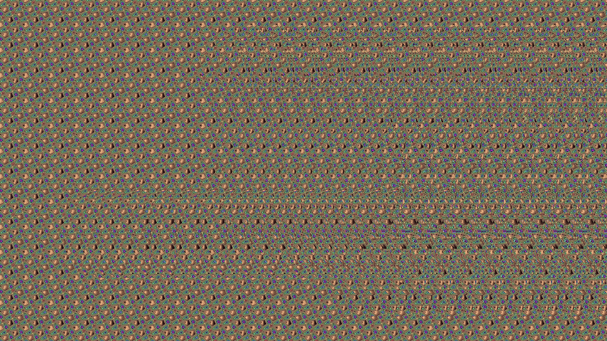

# KStereo
Welcome to KStereo, a stereograms generator written in Pascal.

Original version was coded in 1997, and a couple of stereograms were created. The release, "kstereo.exe", a self-extracting archive, might still be around on some sites.

The FPC/SDL2 version was created in 2024, and introduces more features (scenes, a basic UI interface to preview/generate/reload/save, support for any output resolution, etc). 

Code is not very well documented or straight-forward and in places down right ugly, unfortunately. As I was working on the FPC/SDL2 port, I realized that writing it from scratch would have been a far better approach.

## Media
For the original stereograms, check out the [image gallery](https://www.pirongames.com/nostalgia-kstereo-a-stereograms-generator/)!



## Setup (General)

This project uses submodules and they need to be initialized. 

After cloning the project, run:

```
git submodule init
git submodule update
```

Alternatively, pass --recurse-submodules to git clone (or tick the box in your clone popup if you have a visual git client).

## Setup&Install&Build (FPC SDL2)
Install Free Pascal Compiler (version 3.2.2+)

Run [build_kstereo.bat](fpc-sdl2/build_kstereo.bat) to build and run. 

The executable requires the SDL2 dll: SDL2.dll, SDL2_image.dll and SDL2_ttf.dll. You may find them in one of the releases or use your own.

The executable requires a scene parameter. Test scenes may be found in the [data](fpc-sdl2/data/) folder.

You can modifiy a scene file using an external text editor, then reload it in the program using the "R" key (useful if you want to make adjustments on the fly)

For the list of 3d objects ("obj" group) in the scene, please use the list of objects format. Couldn't figure out how Free Pascal TJSONConfig/jsonconf library reads array of objects, so this is a workaround.

The 3D object type can be:
* "mesh" (in which case provide a mesh in the "var" format)
* "convexsphere" for a SDF-like sphere ("radius" and "pos" properties should be specified)
* "concavesphere" for a SDF-like sphere ("radius" and "pos" properties should be specified)

## Setup&Install&Build (original, DOS)
Turbo Pascal/Borland Pascal is needed to build it. You may want to build [fast_r.pas](original/FAST_R.PAS), as it's, well, fast.

## 3D Objects format
I have lost the 3D objects in var/ascii format that I've used to generate the original stereograms. They still exist as obj, but please note that this is the output of running Borland binobj.exe on the var files - they are data disguised as code in the [OMF 16](https://en.wikipedia.org/wiki/Object_Module_Format_(Intel)) format. 

Not sure why I thought at that time that linking data would be more flexible than reading an external file, but hey, ~30 years after I've learned better :) But it may be possible to recover the data, though.

Meanwhile, a couple of "var" 3d objects which come from my Amorphis demo are available in the [obj3d](fpc-sdl2/data/obj3d/) folder. 

The "var" format is:
* number of vertices (UInt16)
* each vertex contains x, y, z as Int16 (6 bytes)
* number of faces (UInt16)
* each face has 3 vertex indices (UInt16) and a color (byte) (7 bytes)

## TODO
* maybe a Unity plugin ;)

## License

Code license:
https://opensource.org/licenses/MIT
